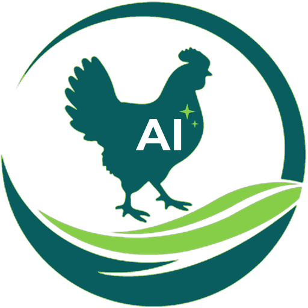

# Inkoko AI: Small AI for poultry health

**Inkoko AI by Orora AgriTech**: an offline early warning for poultry disease, for smallholder farmers in Burundi. *Inkoko* means chicken in Kirundi. A phone photo of fresh droppings is read **on the device**, with no internet. The farmer gets plain advice in **Kirundi**, French or English, and alerts a vet by WhatsApp or SMS.

- **Live app:** https://agritech.ororaagro.com (Kirundi: https://agritech.ororaagro.com/?lang=rn)
- **Challenge:** Hack-Nation 7th Global AI Hackathon, Challenge 4, *Small AI for Development* (The World Bank), sector **agriculture**
- **Built by:** Orora Agro Group, Bujumbura, Burundi, an integrated poultry company with a hatchery and veterinary arm

> **Decision support, not diagnosis.** A person makes the final call. A vet confirms every case; suspected Newcastle disease requires laboratory confirmation and official reporting.

---

## Problem statement

Because of Inkoko AI, **a smallholder poultry farmer in rural Burundi** will **get a first read on a suspected disease and alert a vet the same day** she notices a change in her birds' droppings, which she would otherwise do **late, once birds start dying**. We know because Newcastle disease can infect virtually a whole flock within two to six days and kill up to 100% of it [1], while only 8.6% of Burundians use the internet [2].

| Context, Burundi | Figure | Source |
|---|---|---|
| Individuals using the internet | 8.6% of population (2024) | World Bank WDI, IT.NET.USER.ZS [2] |
| Rural population | 74.3% (2025) | World Bank WDI, SP.RUR.TOTL.ZS |
| Employment in agriculture | 85.3% of total employment (2025, modelled ILO estimate) | World Bank WDI, SL.AGR.EMPL.ZS |
| Mobile cellular subscriptions | 63.2 per 100 people (2023) | World Bank WDI, IT.CEL.SETS.P2 |
| Poverty headcount at $3.00 a day (2021 PPP) | 74.2% (2020) | World Bank WDI, SI.POV.DDAY |
| Newcastle disease | infects virtually all birds in a flock within 2 to 6 days; mortality can reach 100% | WOAH [1] |

## Where it sits in the farmer's day

During the morning round (feeding, water, cleaning) the farmer sees the droppings. She opens the app in the poultry house, where there is no signal, and photographs a fresh pile. In about a second she gets a result, its confidence, and what to do now. If it is serious, she separates the birds and alerts the Orora vet by WhatsApp, or by SMS when she has no data. The check is saved against the flock batch, on her phone.

## What the AI does, and why a simpler tool would not do the job

**Computer vision.** A small image model (MobileNetV3-Small, 1.9 MB) recognises patterns in droppings linked to **coccidiosis, salmonellosis and Newcastle disease**, or a healthy flock. A fifth class, **"not droppings"**, refuses photos of anything else instead of diagnosing them.

An SMS hotline, a spreadsheet or a symptom checklist would need the farmer to describe in words exactly the early changes untrained eyes miss. **Reading the image is the one step that needs AI.** Everything after it is deliberately simple: a **fixed list of answers** written and checked by vets, so nothing is generated and nothing can be invented.

## Guardrails and responsible AI

- **Human in the loop:** the tool informs, a vet decides. Suspected Newcastle disease goes to laboratory confirmation and official reporting (a WOAH-listed disease).
- **"Not sure, ask a person":** below 70% confidence the app says *"unclear: retake the photo or call the vet"* instead of guessing. A photo that is not droppings gets *"Not droppings"* and no diagnosis (99.5% of non-droppings test photos refused, none called healthy).
- **No hallucinations:** no generative text. Every sentence the app can show is in [`app/i18n.js`](app/i18n.js) and can be checked.
- **Privacy:** photos and records **stay on the phone** (browser storage). Nothing is uploaded. A case leaves the phone only when the farmer taps WhatsApp, SMS or share. On a shared or lost phone, the records are visible to whoever opens the app on that phone; they hold the batch number, the result and the time, with no name and no photo.
- **Consent:** photos of producers' farms are taken with their consent.
- **Bias, stated openly:** see *What the data does not cover*.

## Local language

**Kirundi** (code `rn`; shown as **KI** in the app), plus French and English. The full interface and all advice were translated by a native speaker; the advice is to be checked by an Orora vet. The app also plays **Kirundi voice clips** offline next to the advice, for farmers who prefer to listen; the clips are recorded by a person (recordings in progress).

**How it would fare in a less-supported language:** Kirundi is itself low-resource, and the design does not depend on language AI. The answers are a fixed list of about 66 sentences; adding a language means one translation sheet and seven voice recordings, loaded with [`_build/import_kirundi.py`](_build/import_kirundi.py). There is no speech recognition or machine translation to trust with farm advice.

## Data

### Data the model is built with

| Dataset | Use | Source and licence | Size |
|---|---|---|---|
| Machine Learning Dataset for Poultry Diseases Diagnostics, v2 (Machuve et al.) | training, validation, held-out test | Zenodo [10.5281/zenodo.4628934](https://doi.org/10.5281/zenodo.4628934), CC BY 4.0 | 6,812 droppings photos: healthy 2,057 · coccidiosis 2,103 · salmonella 2,276 · Newcastle 376 |
| Same, v3, PCR-annotated | **test only, never trained on** | Zenodo [10.5281/zenodo.5801834](https://doi.org/10.5281/zenodo.5801834), CC BY 4.0 | 1,255 photos confirmed by laboratory PCR (Newcastle 186) |
| Imagenette (fast.ai) and Describable Textures Dataset (Cimpoi et al., Oxford) | "not droppings" class | research use | about 1,400 images (objects, and textures such as soil, cloth, wood) |

Duplicates are removed (318 exact duplicates within v2; no v2 photo matches a PCR photo), and near-identical photos are kept on one side of the train/test split.

### Results (deployed model v1)

| Share of cases caught (recall) | Held-out test (1,128) | Lab-confirmed PCR set (1,255) | PCR set, earlier model v0 |
|---|---|---|---|
| Healthy | 96% | 41% | 49% |
| Coccidiosis | 98% | 48% | 60% |
| Salmonellosis | 93% | 90% | 94% |
| **Newcastle disease** | 94% | **93.5%** | 93% |
| Not droppings (refused) | 99.5% | (none in this set) | (no such class) |
| Overall accuracy | 96% | 65% | 71% |

We report the lab-confirmed column first: it is the honest one. Adding the "not droppings" guard cost 6 points on the lab-confirmed set (some lab photos are now refused, which sends the farmer to retake the photo or call the vet) and kept Newcastle detection at 93.5%. We chose the guard: a confident diagnosis of a photo that is not droppings is the more dangerous error. For Newcastle disease, a false alarm that brings a vet is the safe mistake. The healthy versus coccidiosis confusion is what field validation must fix. Only 0.6% of real droppings in the held-out test were wrongly refused.

### What the data does not cover

- **Not Burundi.** All droppings photos come from farms in Arusha and Kilimanjaro, Tanzania. Burundian breeds, feeds, litter, light and phones are not represented; accuracy on Orora's flocks is **not yet measured**.
- **Four conditions only.** Gumboro, fowl typhoid, fowl pox, worms, avian influenza and other diseases are not covered; such cases fall into the nearest class or "unclear", which is why a vet always confirms.
- **Droppings only.** Respiratory signs, behaviour and mortality are not seen. A healthy-looking dropping does not prove a healthy flock.
- **Small and noisy labels.** v2 labels are farm-assigned; only 1,255 photos (186 Newcastle) are lab-confirmed.
- **The "not droppings" guard** is trained on general research images (objects, textures), not Burundian farm scenes. Farm objects it has not seen (feeders, feed, litter, birds) could still get a droppings result; Orora's own farm photos will replace these images.

## Tech stack

- **Training:** Google Colab notebook [`notebooks/01_baseline_droppings_classifier.ipynb`](notebooks/01_baseline_droppings_classifier.ipynb), generated by [`_build/make_notebook.py`](_build/make_notebook.py). Keras 3 / TensorFlow, MobileNetV3-Small pre-trained on ImageNet, fine-tuned in two phases with class weights.
- **Model:** TensorFlow Lite, float16 (1.9 MB) for the web app; int8 (1.2 MB) for native Android or microcontrollers.
- **App:** offline web app (PWA) in [`app/`](app/): plain HTML, CSS and JavaScript, the TFLite WebAssembly runtime, and a service worker that caches the app, the model and the voice clips. Alerts via `whatsapp://` and `sms:` links.
- **Hosting:** Vercel, deployed from this repository on every push.

## Run it

1. Open the notebook in Google Colab (T4 GPU) and *Run all*. It downloads the data, trains, evaluates, and downloads `app_model.zip`.
2. Unzip `app_model.zip` into `app/model/`.
3. `python -m http.server 8765 --directory app`, then open http://localhost:8765 (`?mock=1` = test mode with random results; `?lang=rn` = Kirundi).

## Scalability and what happens next

- **Field validation** on Orora's own flocks, with photos labelled by Orora vets and confirmed by a laboratory, over 6 to 9 months.
- **Programme pilot** with the producers of Orora Nawe (proposed to Burundi's Ministry of Environment, Agriculture and Livestock; pilot pending).
- **Replicable:** retraining needs only labelled photos (the notebook), a new language needs one translation sheet and seven recordings, and the app is static files any host can serve.

## What localizing AI development means to us

It meets farmers where they are: offline, on their own phone, in Kirundi. Its answers are written by our vets, not generated by a model. It is tested honestly, against laboratory results and soon on Burundian flocks. And the alert lands with people who can act on it, here in Burundi.

## References

1. WOAH (World Organisation for Animal Health), *Newcastle disease*, https://www.woah.org/en/disease/newcastle-disease/
2. World Bank, World Development Indicators, Burundi: IT.NET.USER.ZS, SP.RUR.TOTL.ZS, SL.AGR.EMPL.ZS, IT.CEL.SETS.P2, SI.POV.DDAY, https://data.worldbank.org/country/burundi

## Credits and rights

Droppings datasets: Machuve D., Nwankwo E., Lyimo E., Maguo E., Munisi C. (CC BY 4.0). Sound dataset for phase 2: Aworinde et al., Mendeley Data, [10.17632/zp4nf2dxbh.1](https://doi.org/10.17632/zp4nf2dxbh.1) (CC BY 4.0).
## Licence

The code in this repository is released under the **MIT License** (see [LICENSE](LICENSE)), © 2026 Orora Agro Group, as required by the Hack-Nation Global AI Hackathon terms.

- **Datasets** remain under their own licences (CC BY 4.0 for the droppings and sound datasets, with credit to their authors; research use for Imagenette and DTD). They are downloaded by the notebook, not redistributed here.
- **Third-party libraries** (TensorFlow, TensorFlow.js, the TFLite WebAssembly runtime) remain under their own licences.
- The **Orora Agro Group name and logo** are not covered by the licence.
- The advice text is decision support only and does not replace a veterinarian; see the guardrails above.
